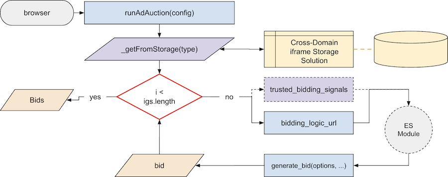

# Bids [§](https://github.com/WICG/turtledove/blob/main/FLEDGE.md#3-buyers-provide-ads-and-bidding-functions-byos-for-now)

Interest groups are used by their owners to bid in on-device auctions.  These buyers choose whether or not to participate in an auction, pick a specific ad, and enter it in the auction along with a bid price and whatever metadata the seller expects.

When the auction is being run, all eligible interest group buyers will be allowed to bid with a request being sent to the buyers `bidding_logic_url`.  This is a URL string that is provided in the [`<InterestGroup>` options `Object`](#types) when adding a user to said interest group.  This URL should expose two functions that the seller will need to provide that handle the bidding at auction time (`generate_bid()`) as well as report the win (`report_win()`) to the appropriate APIs for accounting purposes.  As of right now, there is no information on how these functions need to be exposed, but one can suspect that it will be either an ES Module or windowed object/class that exposes the two functions.  These functions will be exposed using ES Modules and will be imported using dynamic imports.

An example: `"dsp.com/nike/bid.js"`

<!-- toc -->

- [`generate_bid(...)`](#generate_bid)
  * [Option Types](#option-types)
  * [Bidding Flow Diagram](#bidding-flow-diagram)
  * [Validation](#validation)
  * [Return](#return)
  * [Implementation](#implementation)

<!-- tocstop -->

## `generate_bid(...)`

The bidding function that will be provided by the `bidding_logic_url` from the Interest Group owner that will generate a bid in order to run at auction time.

### Option Types

* **`interest_group<InterestGroup>`**: comes from the interest group `Object` that was saved during the process to join an interest group
* **`auction_signals<AuctionConfig.auction_signals>`**: comes from the auction; specifically the `auction_signals` key from the `AuctionConfig`
* **`per_buyer_signals<AuctionConfig.per_buyer_signals[buyer_domain]>`**: comes from the auction; specifically the `per_buyer` key that would match the domain of the interest group buyer with the same key in the Object
* **`trusted_bidding_signals<Object>`**: this is provided by the `InterestGroup` configuration where by the URL and keys are combined to return an `Object` of data
* **`browser_signals<Object>`**: this is provided by the browser, but in this case, it will be arbitrary information we provide, explaining to consumers not to rely too heavily on the information provided

### Bidding Flow Diagram

### Validation

All fields are required and provided to the function when called.

* If one of the fields is missing, return with an `Error` stating a generic message such as "missing fields"
* If, at some time we do handle permissions, then in the event there is missing permissions, the return should be an `Error` describing the reason.

### Return

* If successful, return a `<Object>`. with the signature provided below.
* If failure, return `Error(<reason>)`

An `Object` with the following keys:

* **`ad<Object>`**: this is any arbitrary metadata that the buyer wants to provide to the seller for eligibility into the auction
* **`bid<Number>`**: a number meant to be in a seller-chosen unit
* **`render<String>`**: a URL that will be passed along to an iframe, if the bid wins; this could be an array of strings for when multiple ad slots are supported

### Implementation

Using the [flow diagram](#auction-flow-diagram) as a guide, the following internal functions will be created in order to support joining an interest group:

1. [_getFromStorage](./auctions.md#_getfromstorage28type26ltstring26gt29)

_Note: `report_win()` is detailed in other specifications._
