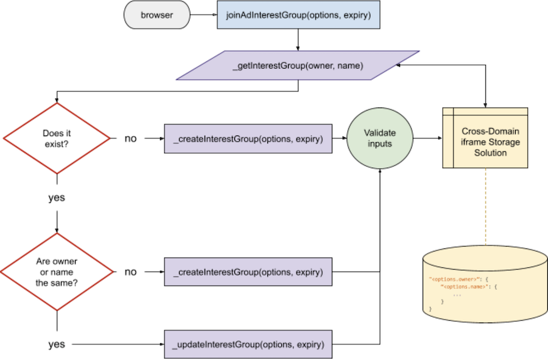
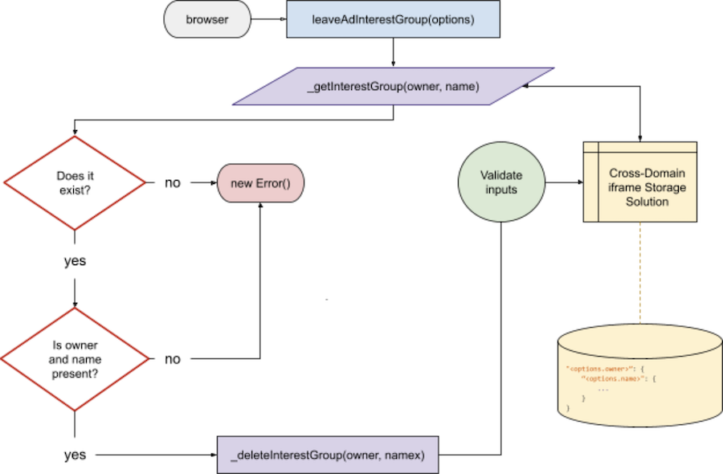

# Interest Groups [§](https://github.com/WICG/turtledove/blob/main/FLEDGE.md#1-browsers-record-interest-groups)

<!-- toc -->

- [Introduction](#introduction)
- [How will they be stored?](#how-will-they-be-stored)
  * [Model](#model)
  * [Types](#types)
    + [InterestGroup](#interestgroup)
    + [UnixTime](#unixtime)
    + [Assumptions](#assumptions)
- [Methods](#methods)
  * [`joinAdInterestGroup(options, expiry)`](#joinadinterestgroupoptions-expiry)
    + [Join Flow Diagram](#join-flow-diagram)
    + [Validation](#validation)
      - [If no `InterestGroup` exists, then](#if-no-interestgroup-exists-then)
      - [If an `InterestGroup` already exists, then](#if-an-interestgroup-already-exists-then)
    + [return](#return)
    + [Implementation](#implementation)
  * [`leaveAdInterestGroup(group)`](#leaveadinterestgroupgroup)
    + [Leave Flow Diagram](#leave-flow-diagram)
    + [Validation](#validation-1)
      - [If an `Object` is passed](#if-an-object-is-passed)
      - [If an empty `Object` is passed](#if-an-empty-object-is-passed)
    + [return](#return-1)
    + [Implementation](#implementation-1)
- [`bidding_logic_url`](#bidding_logic_url)
- [Internal Functions](#internal-functions)
  * [`_getInterestGroup(owner, name)`](#_getinterestgroupowner-name)
  * [`_createInterestGroup(options, expiry)`](#_createinterestgroupoptions-expiry)
  * [`_updateInterestGroup(options, expiry)`](#_updateinterestgroupoptions-expiry)
  * [`_deleteInterestGroup(owner)`](#_deleteinterestgroupowner)
- [Open Questions](#open-questions)

<!-- tocstop -->

## Introduction

An interest group is a way to group users/browser sessions with shared properties for which ads can target allowing the owner of this group to act as the buyer in an auction.

## How will they be stored?

In order to recall an interest group data in the auction, a storage mechanism is required.  The storage of this needs to be keyed by some combination of the `owner` and `name` fields in order to create a unique ID to get or set values.

~~After some discussion with stakeholders (@brodrigu), we've determined to use `owner:name` as the key for storing each interest group over something like `owner` (with nested `name` keys) since removing a group will remove all of its entry and leave no remnants (such as an empty owner) and presumptively match the browser’s implementation more closely.~~

After more discussion, we've determined to go back to using the top-level key of `owner` since the only way to retrieve an interest group is through the `interest_group_buyers` key in the auction configuration object and we won't know the interest group name.  This also allows for the auction to run the `*` (wild card) mechanism in order to allow all interest groups to bid.

The internal data model will be stored within the browser using an undetermined system of storage (e.g. `localStorage`, `sessionStorage`, `indexedDB`, something else) in the format of JSON.  Regardless of the technology choice, all choices will require some form of [Cross-Domain Sharing](https://github.com/aviboy2006/cross-domain-cookie-sharing) to exploit the same-origin policy restrictions that the browser enforces. There is a [discussion around this topic](https://github.com/MagniteEngineering/fledge.polyfill/discussions/7).

### Model

The following is the storage model and will be later referred in the document as `InterestGroup` when referring to its data structure:

```json
"<options.owner>":<options.name>": {
    "_created": "<Date.now()>",
    "_updated": "<unix_timestamp_in_ms_from_daily_update_url_call>",
    "_expires": "<this._created + (expiry * 86400000)>",
    "owner": "<options.owner>",
    "name": "<options.name>",
    "bidding_logic_url": "<options.bidding_logic_url>",
    "daily_update_url": "<options.daily_update_url>",
    "trusted_bidding_signals_url": "<options.tbs_url>",
    "trusted_bidding_signals_keys": "<options.tbs_keys>",
    "user_bidding_signals": "<options.user_bidding_signals>",
    "ads": "<options.ads>"
}
```

### Types

The following is the data types when referring to the [internal data model](#model) and anytime a function accepts an `<InterestGroup>` as a parameter.

Any type that is suffixed with a `?` is meant to signify that its an optional parameter when creating an interest group.

#### InterestGroup

* **owner**: _String<URL\>_ (e.g. `"www.dsp.com"`)
* **name**: _String_ (e.g. `"womens-running-shoes"`)
* **bidding_logic_url**: _String<URL\>_ (e.g. `"dsp.com/nike/bid.js"`)
* **daily_update_url?**: _String<URL\>_ (e.g. `"dsp.com/nike/update"`)
* **trusted_bidding_signals_url?**: _String<URL\>_ (e.g. `"kv-server.com"`)
* **trusted_bidding_signals_keys?**: _Array<String\>_ (e.g. `[ "budget", "size" ]`)
* **user_bidding_signals?**: _Object_ (e.g. `{ timestamp: 123456789, hostname: "nike.com", path: "/w/womens-running-shoes" }`)
* **ads?**: _Array<Object\>_ (e.g. `[ { rendering_url: "s3.aws.com/ad1.html", meta: { … } }, ... ]`)

#### UnixTime

This is, as described by [Wikipedia](https://en.wikipedia.org/wiki/Unix_time#:~:text=The%20Unix%20epoch%20is%20the,%2D01T00%3A00%3A00Z.):

> a number of seconds that have elapsed since the Unix epoch, minus leap seconds

So any mention of `<UnixTime>` in this document is in reference to that format, with the exception that we're converting it to milliseconds as is suggested by the [Fledge Proposal](https://github.com/WICG/turtledove/blob/main/FLEDGE.md#11-joining-interest-groups) in their example code snippet.

#### Assumptions

* The specific type of data for the Ads field is left unstructured at this time until we can involve DSPs.
* There is no specific mention of any field besides owner and name being required, but we’re making the assumption that the data structures listed above would be meaningless without some of the fields, such as bidding logic URL, being required.

## Methods

### `joinAdInterestGroup(options<InterestGroup>, expiry<Number>)`

When a "user" lands on a "buyer's" page, this API method will allow them to create and/or create an interest group with some properties that define the group and subsequently allow the "user" to join the interest group.  The method accepts two parameters, an options `Object` that is of the type [`<InterestGroup>`](#InterestGroup), and an expiry [`Number`](https://developer.mozilla.org/en-US/docs/Web/JavasScript/Reference/Global_Objects/Number).

#### Join Flow Diagram



#### Validation

❗ As of today (2021-03-25), there is an [issue filed](https://github.com/WICG/turtledove/issues/159) with Chrome to determine the data structure of the `expiry` and whether its required or optional and if there is a default value.  This will impact the validation below and the internal functions.

##### If no `InterestGroup` exists, then

1. If no `<InterestGroup>` is passed in, throw an `Error` stating a generic message such as "missing fields"
2. If required fields are missing from `<InterestGroup>`, throw an `Error` stating a generic message such as "missing fields"
3. If, at some time we do handle permissions, then in the event there is missing permissions, throw an `Error` describing the reason.
4. If no `expiry` is passed in, throw an `Error` stating a generic message such as "missing fields"
~4. If an `expiry` is passed in and is not a valid [`Date`](https://developer.mozilla.org/en-US/docs/Web/JavaScript/Reference/Global_Objects/Date), throw an `Error` stating a generic message such as "invalid Date"~
~5. If no `expiry` is passed in, then default to 30 days~


##### If an `InterestGroup` already exists, then

1. If the same owner and name is passed in, then "[merge](https://github.com/WICG/turtledove/issues/113#issuecomment-798985166)" with the existing data, update the internal _updated_ field to the current time and _expires_ field will be 30 days past the current time
2. If owner or name is passed in and doesn't match an existing group, then create an entirely new record with the options passed in, adding in the internal _created_ field and _updated_ field to the current date
3. If, at some time we do handle permissions, then in the event there is missing permissions, throw an `Error` describing the reason.
~4. If `expiry` is passed in and it is beyond 30 days from the created day, then default to the maximum of 30 days~
4. If `expiry` is passed in and it is beyond 30 days (2592000000), throw an `Error`, stating a generic message such as "number beyond maximum allowed"

#### return

* If successful, return `Boolean(true)`
* If failure, throw `Error(<reason>)`

#### Implementation

Using the [flow diagram](#join-flow-diagram) as a guide, the following internal functions will be created in order to support joining an interest group:

1. [_getInterestGroup](#_getinterestgroup28owner26ltstring26gt-name26ltstring26gt2)
2. [_createInterestGroup](#_createinterestgroup28options26ltinterestgroup26gt-expiry26ltunixdate26gt-3D-2830-2A-2)
3. [_updateInterestGroup](#_updateinterestgroup28options26ltinterestgroup26gt-expiry26ltunixdate26gt-3D-2830-2A-2)

### `leaveAdInterestGroup(group<InterestGroup>)`

The complementary API to leave an interest group. This can be called from within an ad to allow a user to report an ad or request to no longer see the ad or interest group that they've been placed in.  One can imagine an scenario where Chrome will create a UI for the user to access the Interest Groups they're apart of and allow them to leave them.

#### Leave Flow Diagram



#### Validation

##### If an `Object` is passed

1. If both the `name` and `owner` passed in exist, delete the record
2. If one of the `name` and `owner` passed in is missing, throw an `Error` stating a generic method such as "missing fields"
3. If the owner and/or name passed in is not found, throw an `Error` stating a generic message such as "record not found"

##### If an empty `Object` is passed

1. If an empty `Object` is passed within an ad already rendered on the page, delete the record. This is designed for an ad’s creative to allow for a user to hide that particular ad and never show it again.

One [open question](https://github.com/MagniteEngineering/fledge.polyfill/discussions/8) is how will the browser pass along the interest group information.  It’s possible that this could be passed in via the browser_signals in the score_ad function within the auction.

#### return

* If successful, return `Boolean(true)`
* If failure, throw `Error(reason)`

#### Implementation

Using the [flow diagram](#leave-flow-diagram) as a guide, the following internal functions will be created in order to support joining an interest group:

1. [_getInterestGroup](#_getinterestgroup28owner26ltstring26gt-name26ltstring26gt2)
2. [_deleteInterestGroup](#_createinterestgroup28options26ltinterestgroup26gt-expiry26ltunixdate26gt-3D-2830-2A-2)

## `bidding_logic_url`

This is a URL string that is provided in the [`<InterestGroup>` options `Object`](#InterestGroup) when creating or updating an interest group’s attributes.  This URL should expose two functions that the buyer will need to provide that handle the bidding at auction time (`generate_bid()`) as well as report the win (`report_win()`) to the appropriate APIs for accounting purposes.  As of right now, there is no information on how these functions need to be exposed, but one can suspect that it will be either an ES Module or windowed object/class that exposes the two functions.  An [open discussion](https://github.com/MagniteEngineering/fledge.polyfill/discussions/9) has been created for tracking purposes.

An example: `"dsp.com/nike/bid.js"`

_Note: `generate_bid()` and `report_win()` and are detailed in other specifications._

## Internal Functions

Detailed are the internal functions and their parameters that will be called at various stages of the two aforementioned API methods.

### `_getInterestGroup(owner<String>, name<String>)`

This function is designed to retrieve a specific record from the internal storage, including all private/internals from the interest group.  Both parameters are required.

* **Private/Public**: Private
* **Return**: If found, return full record.  If no record found, return `null`

### `_createInterestGroup(options<InterestGroup>, expiry<Number>)`

This function is designed to create a new record in the internal storage, including all private/internals for the interest group.  Only the `options` parameter is required; if no `expiry` is passed in, then the number will be set to the default value.  This will also validate the existence of any required field, following the [validation rules](#validation).

* **Private/Public**: Private
* **Return**: If successful, return `true`.  If failure, throw an `Error` with a message if it fails.

### `_updateInterestGroup(options<InterestGroup>, expiry<Number>)`

This function is designed to update an existing record in the internal storage, including all private/internals for the interest group.  Only the `options` parameter is required; if no `expiry` is passed in, then the number will be set to the default value.  This will also validate the existence of any required field, following the [validation rules](#validation).

* **Private/Public**: Private
* **Return**: If successful, return `true`.  If failure, throw an `Error` with a message if it fails.

### `_deleteInterestGroup(owner<String, name<String>)`

This function is designed to delete an existing record in the internal storage for the interest group based on it's owner and name. Both parameters are required.  It should remove the name `Object` and not the entire owner `Object`, even if there are no more interest groups.  It should also remove an interest group if the `expires` key in an interest group has lapsed.

* **Private/Public**: Private
* **Return**: If successful, return `true`.  If failure, throw an `Error` with a message if it fails.

## Open Questions

* [Interest Group Clean Up](https://github.com/MagniteEngineering/fledge.polyfill/discussions/5)
* [Storage Limits](https://github.com/MagniteEngineering/fledge.polyfill/discussions/6)
* [Expiry as UnixTime or Number](https://github.com/WICG/turtledove/issues/159)
