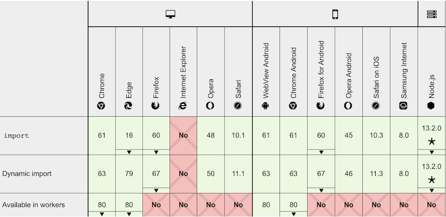
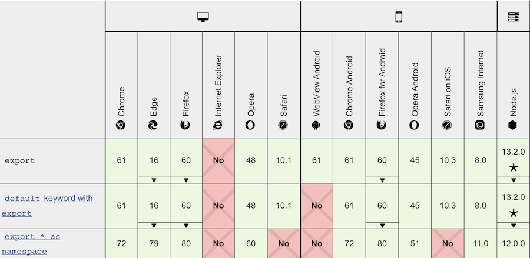

# ES Modules Prototype

The following is meant to showcase ES Modules support in modern browsers, particularly the ones that will be required to support the Fledge proposal when it is released. 

Following the [discussion in GitHub](https://github.com/MagniteEngineering/fledge.polyfill/discussions/9), this will be used in how we recommend and expose the `score_ad` and `report_result` functions for sellers and `generate_bid` and `report_win` functions for buyers.

As of this experiment, the earliest version of Chrome that would contain Fledge support would be v91, which is set to be released in June of 2021. According to [MDN's Guide to Modules](https://developer.mozilla.org/en-US/docs/Web/JavaScript/Guide/Modules), full support for ES modules is as follows, which means any browser supporting Fledge would support ES modules.

_import_

_export_

## Running the Demo

You will need to run a server within the current directory.  Using `npx serve` within the current working directory would suffice.  It will provide you a URL that you can paste into the browser. 

From that URL, you should see that the `index.html` page is calling a script called `scripts/app.js`, which imports an ES module from another file (`scripts/tag.js`). 
