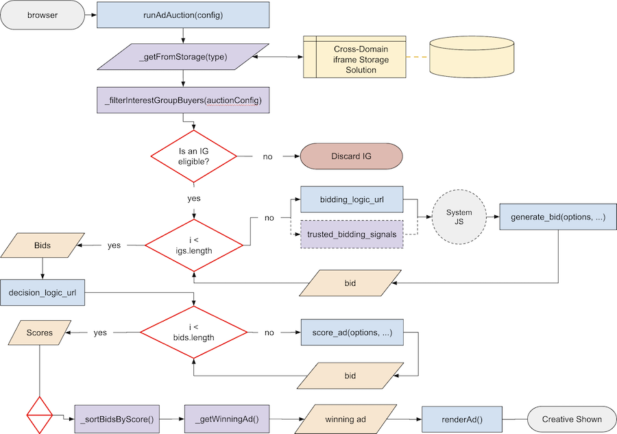

# Auctions [§](https://github.com/WICG/turtledove/blob/main/FLEDGE.md#2-sellers-run-on-device-auctions)

<!-- toc -->
<!-- end:toc -->

## Introduction

An auction done entirely within a browser worklet with no network access, which allow sellers to decide the buyers, which bids from interest groups are eligible, the logic to determine the winning bid and reporting the outcome.

## How will they be stored?

The same mechanism being created for storing Interest Groups will be used to process the auction, including the scoring of all ads/bids that are sent into the auction by buyers.  [See the current discussion on storage types](https://github.com/MagniteEngineering/fledge.polyfill/discussions/7).

### Model

The following is the storage model and will be later referred in the document as `AuctionConfig` when referring to its data structure:

```json
"<options.seller>": {
  "<`${window.top.location.origin}${window.top.location.pathname}`>": {
    "<adslot_id>": {
      "seller": "<options.seller>",
      "decision_logic_url": "<options.decision_logic_url>",
      "trusted_scoring_signals_url": "<options.trusted_scoring_signals_url>",
      "interest_group_buyers": "<options.interest_group_buyers.keys()>",
      "additional_bids": "<options.additional_bids>"
      "auction_signals": "<options.auction_signals>",
      "seller_signals": "<options.seller_signals>",
      "per_buyer_signals": "<options.per_buyer_signals>"
    }
  }
}
```

### Types

The following is the data types when referring a function that accepts an `<AuctionConfig>` as a parameter.

Any type that is suffixed with a `?` is meant to signify that its an optional parameter when creating an interest group.

* **seller**: _String<URL\>_ (e.g. `"www.dsp.com"`)
* **decision_logic_url**: _String<URL\>_ (e.g. `"dsp.com/nike/bid.js"`)
* **trusted_scoring_signals_url**: _String<URL\>_ (e.g.  `"dsp.com/scoring-signals"`)
* **interest_group_buyers**: _Array<URL > | *_ (e.g. `[ "www.tradedesk.com", "nike.com" ]`)
* **additional_bids?**: _Array_
* **auction_signals?**: _Object_
* **seller_signals?**: _Object_
* **per_buyer_signals?**: _Object_

### Assumptions

* While the proposal states that rendering of the winning ad will happen in an Fenced Frame, we will have to render it in a traditional `iframe`
* The `browser_signals` provided to the `score_ad()` function will be provided by us with our best guess as to what the final object may resemble, but consumers are warned not to rely on the signals coming from that too much as it is highly subject to change
* The final proposal will be much more secure that what is possible by doing everything within a Cross-Domain Sharing storage solution

## Methods

### `runAdAuction(config<AuctionConfig>)`

When a "user" lands on a "seller's" page, this API method will allow them run an auction.  The method accepts one parameter, an configuration `Object` that is of the type [`<AuctionConfig>`](#types).

#### Auction Flow Diagram



#### Validation

1. If no `<AuctionConfig>` is passed in, return with an `Error` stating a generic message such as "missing fields"
2. If required fields are missing from `<AuctionConfig>`, return with an `Error` stating a generic message such as "missing fields"
3. If, at some time we do handle permissions, then in the event there is missing permissions, the return should be an `Error` describing the reason.

#### Return

* If successful and contains a winning bid, return a `<Promise>`.  While the proposal will maintain this is `opaque`, within our trials we won't support that feature as we won't have any way to do so.
* If successful and does not contain a winning bid, return a `null`
* If failure, return `Error(<reason>)`

#### Implementation

Using the [flow diagram](#auction-flow-diagram) as a guide, the following internal functions will be created in order to support joining an interest group:

1. [_getFromStorage](#_getfromstorage28type26ltstring26gt29)
2. [_filterInterestGroupBuyers](#_filterinterestgroupbuyers28auctionconfig26ltauctionconfig26gt29)
3. [_filterBidsByScore](#_filterbidsbyscore28bids26lt5Bbid5D26gt29)
4. [_sortBidsByScore](#_sortbidsbyscore28bids26lt5Bbid5D26gt29)
5. [_getWinningBid](#_getwinningbid28bids26lt5Bbid5D26gt29)

## `decision_logic_url`

This is a URL string that is provided in the [`<AuctionConfig>` options `Object`](#types) when running an auction.  This URL should expose two functions that the seller will need to provide that handle the scoring of ads at auction time (`score_ad()`) as well as report the win (`report_result()`) to the appropriate APIs for accounting purposes.  As of right now, there is no information on how these functions need to be exposed, but one can suspect that it will be either an ES Module or windowed object/class that exposes the two functions.

An example: `"ssp.com/espn/auction.js"`

### `score_ad(ad_metadata<Object>, bid<Number>, auction_config<AuctionConfig>, trusted_scoring_signals, browser_signals<Object>)`

The scoring function that will be provided by the `decision_logic_url` from the seller that will process each eligible bid in order to provide a numerical score, some metadata and a URL to render the creative.

* **ad_metadata**: this comes from each bid; specifically the `ad` key in the return value of each `generate_bid()` function.
* **bid**: this comes from each bid; specifically the `bid` key in the return value of each `generate_bid()` function.
* **auction_config**: this is provided by the auction; it is the configuration that is provided by the auction when initially called
* **trusted_scoring_signals**: this is provided by the auction configuration with the base URL being the `trusted_scoring_signals_url` key and the return value of each `generate_bid()` functions `render_url` key (e.g. `kv-server.com?hostname=<interest_group.owner>&keys=<render_url>`)
* **browser_signals**: this is provided by the browser, but in this case, it will be arbitrary information we provide, explaining to consumers not to rely too heavily on the information provided

#### Validation

All fields are required and provided to the function when called in the context of the Cross-Domain storage solution.

#### Return

* A numerical value of greater than 0, indicates an eligible bid
* A numerical value of less than or equal to 0, indicates an ineligible bid

_Note: `report_result()` and are detailed in other specifications._

### `renderAd(bid<Bid>)`

The function designed to create an `iframe` on the sellers page that will render the ads creative for the winning bid.

### `generate_bid()`

This will be detailed in another specification.

## Internal Functions

Detailed are the internal functions and their parameters that will be called at various stages of the two aforementioned API methods.

### `_getFromStorage(type<String>)`

This function is designed to retrieve a set of data from the Cross-Domain storage system (e.g. InterestGroups, Bids, etc.).

* **Private/Public**: Private
* **Return**: If successful and a record exists, return `Object<InterestGroup>`; If no record found, return `null`.

### `_filterInterestGroupBuyers(auctionConfig<AuctionConfig>)`

This function takes in an auction configuration `Object` and filters out the `interest_group_buyers` key, stored as an `Array<String>`, in order to process the eligible interest groups. If wild card `String` in the form of `*` is passed instead, then all interest groups will be eligible to bid.

* **Private/Public**: Private
* **Return**: If successful, return `Array<InterestGroup>`; If no record found, return `null`.

### `_filterBidsByScore(bids<[Bid]>)`

This function is designed to take all bids and filter out any record that has a score of less than or equal to 0.

* **Private/Public**: Private
* **Return**: If successful, return `Array<Bid>`; If failure, throw an `Error` with a message.

### `_sortBidsByScore(bids<[Bid]>)`

This function is designed to take all bids and sort each record by the highest to lowest score.

* **Private/Public**: Private
* **Return**: If successful, return a sorted `Array<Bid>`. If failure, throw an `Error` with a message.

### `_getWinningBid(bids<[Bid]>)`

This function is designed to retrieve the "winning bid".  At the time that is meant to mean the bid with the highest score, but over time this may mean the bid with the highest score that meets other criteria.

* **Private/Public**: Private
* **Return**: If successful and a record exists, return a single `<Bid>`; If no record found, return `null`.

## Open Questions

* [Storage Limits](https://github.com/MagniteEngineering/fledge.polyfill/discussions/6)
